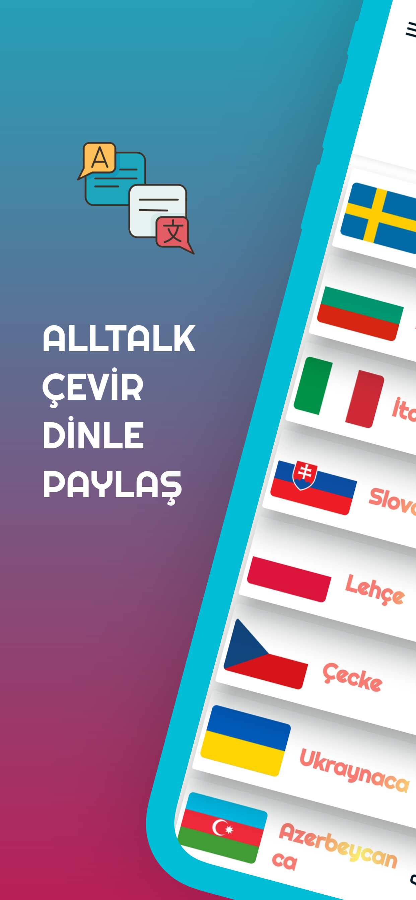
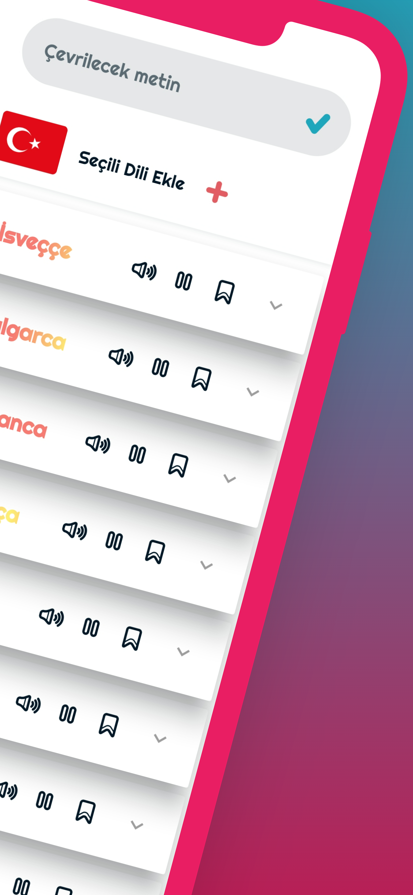
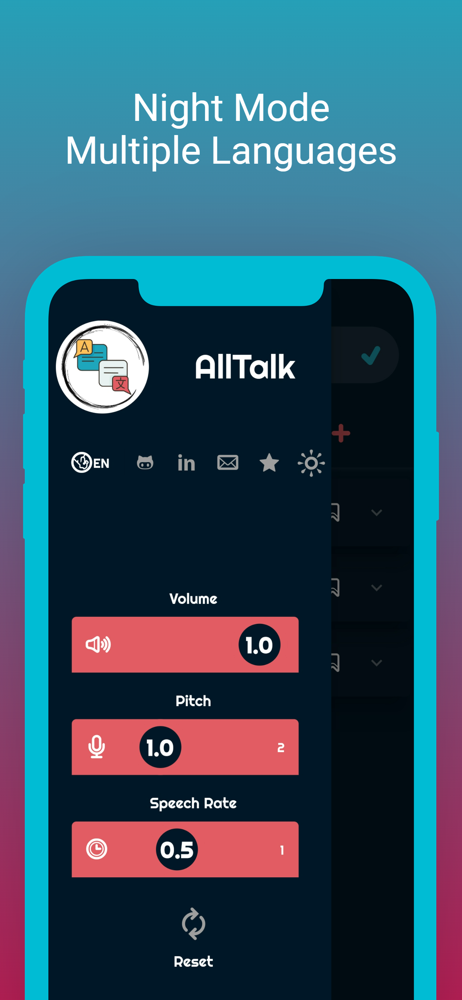
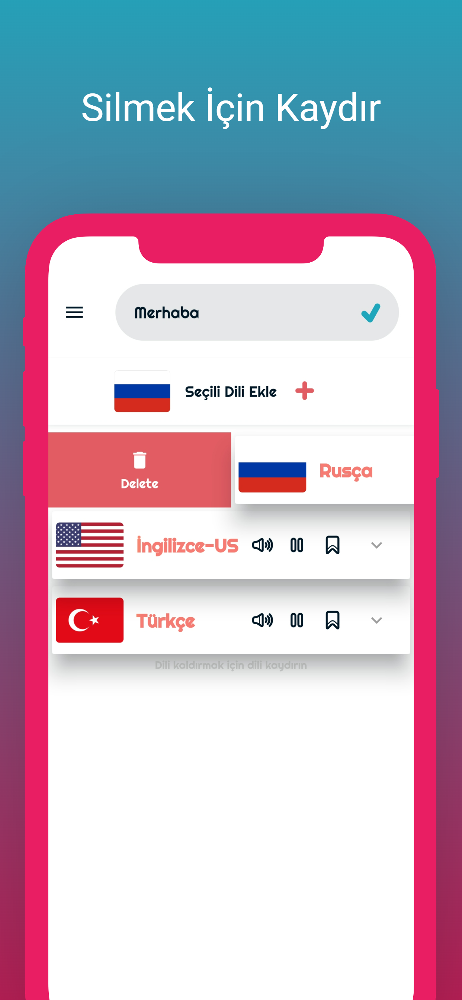

# ALLTALK ÇEVİRİ
Birden çok dile aynı anda çeviri yapabileceğiniz ve çeviriyi ait olduğu dilin aksanı ile dinleyebilceğiniz bir çeviri uygulaması.

  

# Ana Sayfa
> InternetConnectionChecker
> AnimatedIconButton
> Slidable

- Birden çok dile aynı ekran üzerinden erişim,
- Çeivirinizi canlı olarak dinleyin, çevirilen dilin karakterleri şeklinde kopyalayın

  

# Drawer & Slidable
> FluidSlider

- 30+ dilden arayüze istediğiniz ekleyin, kullanmadıklarınızı çıkartın
- Konuşma hızını ve diğer ses özelliklerini konfigüre etmek için,
- Uygulama dilini Türkçe ve İngilizce arasında değiştirmek için,
- Gece modunu kullanmak için drawer menü'yü kullanın：

  
 

